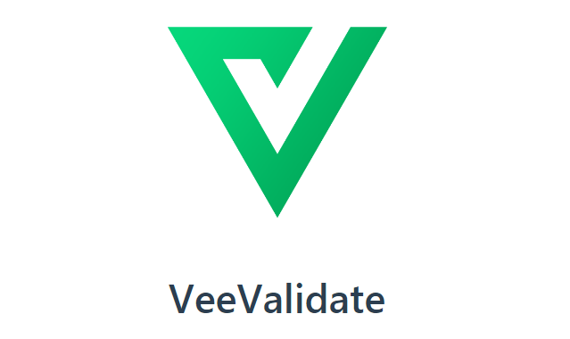

# VeeValidate V3 Migration



## Introduction

Hello ! Welcome to the VeeValidate V3 migration guide ! 

In this guide, I will give you some instructions to help you migrate VeeValidate from V2 to V3. 

V3 embarks a lot of breaking changes. The biggest change is the v-validate directive, because it's no longer available (!). So it's going to be a long journey (it depends on how many times you use this directive) but it is not that hard if you follow the [official migration guide](https://vee-validate.logaretm.com/v3/migration.html#migrating-from-2-x-to-3-0) and follow my different tips to avoid issues.

It's a non-exhaustive guide, I will try to help you with [my experience on Partner migration](https://gitlabdev.vadesecure.com/partner/partner-ui/-/merge_requests/1426). If you encounter any other issues during your migration, be free to update the guide with your different troubleshooting.

Ready ? Let's Go !

## Table of Contents

- [VeeValidate migration](#veevalidate-migration)
  - [Introduction](#introduction)
  - [Table of Contents](#table-of-contents)
  - [Step 1: Setup VeeValidate](#step-1-setup-veevalidate)
  - [Step 2: Update your code](#step-2-update-your-code)
    - [Import ValidationObserver and ValidationProvider](#import-validationobserver-and-validationprovider)
    - [ValidationObserver](#validationobserver)
    - [ValidationProvider](#validation-provider)
  - [Resources](#resources)

## Step 1: Setup VeeValidate

Firstly, you need to update VeeValidate to the latest version available:

```json
// package.json

  "dependencies": {
    ...
    "vee-validate": "3.4.X",
    ...
```

> **Note:** By the way, run `npm install`

Once done, you need to configure vee-validate.

If it's not the case, I suggest you to move the configuration of i18n and vee-validate in separate files for more clarity. 

Here is the **Partner** tree structure:

```tree
├── src
│   ├── assets
│   ├── **
│   ├── **
│   ├── views
│   ├── main.js
│   ├── i18n.js
│   ├── vee-validate.js
```

In *i18n.js*, we are going to configurate the translation. 

Here's *i18n.js* content on Partner:

> **Warning:** You need to keep your project's configuration. This is an **how to** example

```js
// i18n.js

import Vue from 'vue'
import validationMessagesEN from 'vee-validate/dist/locale/en.json'
import validationMessagesFR from 'vee-validate/dist/locale/fr.json'
import VueI18n from 'vue-i18n'
import { lang } from './main'

// Import translations
import fr from './locales/fr'
import en from './locales/en'

Vue.use(VueI18n)

// i18n
const messages = {
    ...fr,
    ...en,
}

// Add Vee Validate validation messages
messages.en.validations = validationMessagesEN
messages.fr.validations = validationMessagesFR

const i18n = new VueI18n({
    locale: lang,
    fallbackLocale: 'en',
    messages
})

export { i18n }
```

> **Note:** As you can see the vee-validate error messages are now imported from a json file

In *vee-validate.js*, there's the configuration of default error message to display and the import of each rules.

Here's the *vee-validate.js* content on Partner:

```js
// vee-validate.js

import { configure, extend } from 'vee-validate'
import { required, required_if, email, excluded, min, regex, min_value, max_value } from 'vee-validate/dist/rules'
import { i18n } from './i18n'

// VeeValidate Setup
configure({
    // this will be used to generate messages.
    defaultMessage: (field, values) => {
        values._field_ = field
        return i18n.t(`validations.messages.${values._rule_}`, values)
    }
})

// VeeValidate rules
extend('required', {
    ...required,
    message: i18n.t('errors.REQUIRED_FIELD')
})
extend('email', {
    ...email,
    message: i18n.t('errors.PLEASE_ENTER_A_VALID_EMAIL_ADDRESS')
})
extend('excluded', excluded)
extend('min', min)
extend('required_if', {
    ...required_if,
    message: i18n.t('errors.REQUIRED_FIELD')
})
extend('regex', regex)
extend('min_value', min_value)
extend('max_value', max_value)
```

As you can see you can easily customize the error message returned by vee-validate.

> **Note:** I don't import every rules available. More rules [here](https://vee-validate.logaretm.com/v3/guide/rules.html#rules)

> **Warning:** As you can see rules are no longer automatically imported. So, don't forget to import the rules you want to use.
This is why I recommand you to create separate file for i18n and vee-validate configuration. Thanks to this separation, when you import the rules on vee-validate.js, it's imported on the entire project.

Now you can remove `Vue.use(VeeValidate)` and its import in *main.js*

```js
// main.js

...
import VeeValidate from 'vee-validate' // remove
...
Vue.use(VeeValidate) // remove
...
```

Finally, we can import i18n and vee-validate in *main.js*:

```js
// main.js

...
import { i18n } from './i18n'
import './vee-validate'
...

new Vue({
    ...
    i18n,
    ...
})
```

Your project is now ready for the migration! 👌

## Step 2: Update your code

You will have to replace every *v-validate* directives by the newest Validation components. It's going to be very redunding.

### Import ValidationObserver and ValidationProvider

ValidationObserver and ValidationProvider are the new components available with this version.
The first step is to import these components.

So, ValidationObserver and ValidationProvider need to be imported in each components where you use them. You can import them by this way:

```js
...
import { ValidationProvider, ValidationObserver } from 'vee-validate'
...
export default {
    ...
    components: {
      ...
      ValidationObserver,
      ValidationProvider,
      ...
    }
    ...
}
```

Now you can use them in your component !

### ValidationObserver

In **V2**, clicking on the button directly call the method to check the validity of the form:

```html
<form class="vs-form bg-grey" data-vv-scope="template">
  <div class="container">
      ...
      <div class="send">
        <button type="button"
              label="SUBMIT"
              @event:clicked="methods()"
        ></button>
      </div>
      ...
  </div>
</form>
```

```js
methods() {
  this.$validator.validateAll('client').then((res) => {
    if (res) {
      // CONTENT
    }
  })
  .catch((err) => {
      this.$notify({ group: 'alert', type: 'error', title: this.$t('errors.ERROR'), text: err })
  })
}
```

In **V3**, VeeValidate checks if the form is valid before calling the method. It start checking when you click on the submit button. If the form is valid, the method is called !

So we need to encapsulate the form in *validation-observer*:

```html
<validation-observer v-slot="{ handleSubmit }">
    <form @submit.prevent="handleSubmit(methods)">
        <div class="container">
            ...
            <div class="send">
                <button type="submit" label="Submit"></button>
            </div>
            ...
        </div>
    </form>
</validation-observer>
```

And simplify the method by deleted all validation related code:

```js
methods() {
  // CONTENT
}
```

> **Warning:** The button needs to be in the *validation-observer* components AND have the 'submit' type. If it's not the case, your form can't be submitted and none method is called.

### Validation Provider

Now we are going to talk about the *validation-provider* components.

In **V2**, we just apply the *v-validate* directive on the input or select tag:

```html
<div class="input-container no-margin">
    <input v-model="tempClient.email" 
        v-validate="'required|email'"
        name="email"
        class="vs-input"
        :class="{ error: errors.has('client.email')}"
    >
</div>

```

In **V3**, we need to remove this directive and encapsulate the input container:

```html
<validation-provider rules="required|email>
    <div class="input-container no-margin">
        <input name="email" v-model="tempClient.email" 
            class="vs-input"
        >
    </div>
</validation-provider>
```
> **Warning**: **v-model** is necessary

As you can see, no more *v-validate* directive. Instead we encapsulate the input container in a *validation-provider* and just add a 'rules' to his props. 

To display an error, you need to add a *v-slot* in validation-provider tag to be able to use the vee-validate error message:

```html
<validation-provider rules="required|email" name="email" v-slot="{ errors }">
    <div class="input-container no-margin">
        <input v-model="tempClient.email" 
            class="vs-input"
        >
        <span>{{ errors[0] }}</span>
    </div>
</validation-provider>
```

Now you need to apply it in your whole project. Good Luck !

## Resources

- More information on [VeeValidate](https://vee-validate.logaretm.com/v3)
- More information on [VeeValidate migration](https://vee-validate.logaretm.com/v3/migration.html#migrating-from-2-x-to-3-0)
- More information on [VeeValidate rules](https://vee-validate.logaretm.com/v3/guide/rules.html#rules)
- How we did on [Partner](https://gitlabdev.vadesecure.com/partner/partner-ui/-/merge_requests/1426)